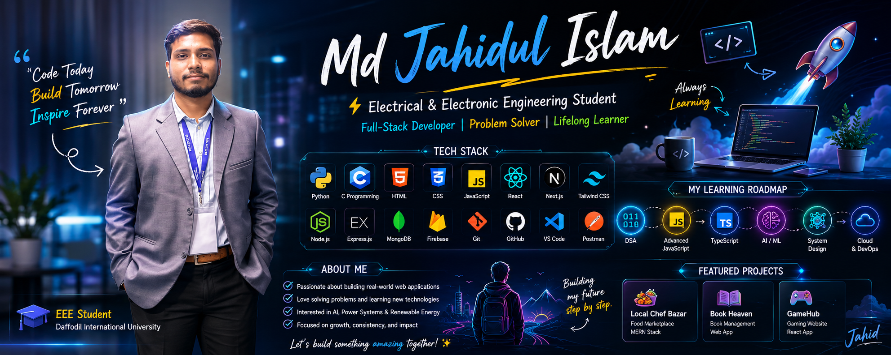

# Hi 👋, I'm Md Jahidul Islam

<p align="center">
  
</p>

<h3 align="center">⚡ Electrical & Electronic Engineering Student | 💻 Full-Stack MERN & Next.js Developer | 🚀 Lifelong Learner</h3>

<p align="center">

</p>

## 🌐 Connect

[](https://jahid-portfolio-peach.vercel.app/)
[](https://www.linkedin.com/in/md-jahidul-islam-3741-)
[](https://github.com/jahid3741)
[](https://www.facebook.com/mdjahidulislam3741/)
[](https://www.instagram.com/mdjahidulislam3741/)
[](mailto:islam2305131153@diu.edu.bd)

---

## 👨‍💻 About Me

- 🎓 Final-year EEE student at Daffodil International University
- 💻 Full-Stack MERN & Next.js Developer
- 🌱 Learning TypeScript, AI, Docker, Cloud Computing & System Design
- 🚀 Passionate about modern web development and real-world solutions
- 💼 Open to internships and collaborations

## 🛠 Tech Stack

<p align="center">

</p>

## 📊 GitHub Stats

<p align="center">


</p>

<p align="center">

</p>

## 🏆 GitHub Trophies

<p align="center">

</p>

## 🐍 Contribution Snake

> Enable the GitHub Action later, then uncomment:

```md
<!--
<p align="center">

</p>
-->
```

## 🚀 Featured Projects

### 🍽 Local Chef Bazar

- MERN Stack Homemade Food Marketplace
- JWT Authentication
- Responsive Dashboard
- MongoDB + Express + React + Node.js

### 📚 Book Heaven

Book management platform with authentication and CRUD.

### 🎮 GameHub

Gaming website built with React.

## 🌱 Currently Learning

- TypeScript
- Next.js
- Docker
- AI & Machine Learning
- Cloud Computing
- Data Structures & Algorithms
- System Design

---

<p align="center">
⭐ Thanks for visiting my profile!<br>
<b>Keep Learning • Keep Building • Keep Growing 🚀</b>
</p>
